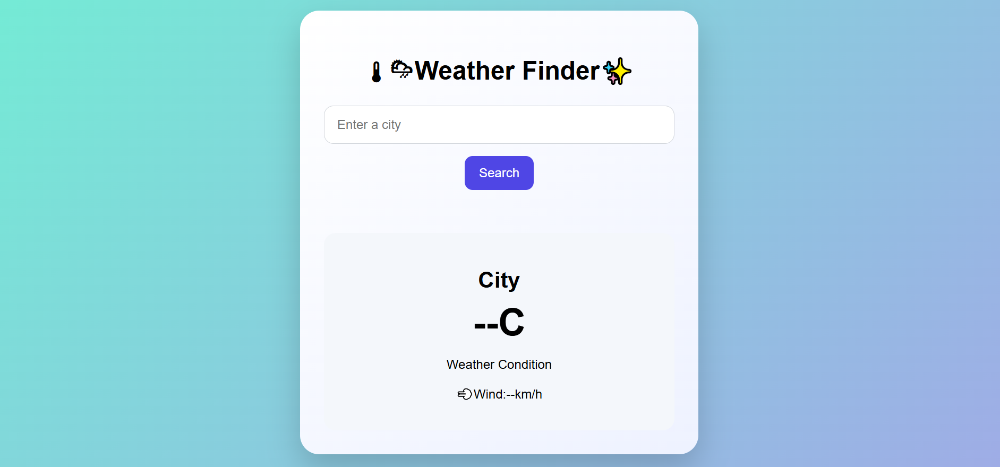

# 🌤️ Weather Finder

A responsive weather application built with **HTML, CSS, and JavaScript** that allows users to search for a city and view its current weather information.

The application uses the **Open-Meteo APIs** to find a city's geographic coordinates and retrieve its current weather data.

## ✨ Features

* 🔍 Search for any city
* 🌡️ View current temperature
* ☁️ View current weather conditions
* 💨 View wind speed
* ⚠️ Helpful error messages for invalid or empty searches
* 📱 Responsive design
* 🌐 Weather data retrieved through external APIs

## 📸 Preview

## 🌐 Live Demo

[View Weather Finder Live](https://maryamdevlabs.github.io/Weather-finder/)

## 🛠️ Built With

* HTML5
* CSS3
* JavaScript
* Open-Meteo Geocoding API
* Open-Meteo Weather API

## ⚙️ How It Works

1. The user enters a city name.
2. The application sends the city name to the Open-Meteo Geocoding API.
3. The API returns the city's latitude and longitude.
4. Those coordinates are sent to the Open-Meteo Weather API.
5. The current weather data is retrieved and displayed.
6. Invalid or empty searches display an appropriate error message.

## 📂 Project Struc
